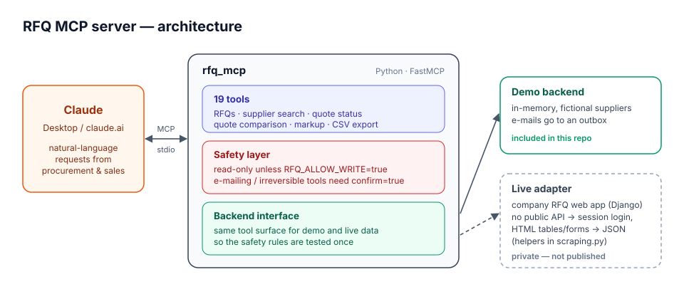
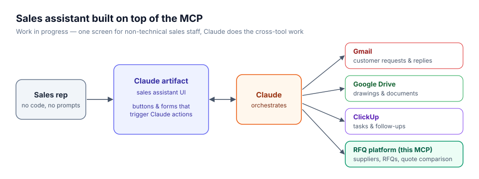

# RFQ MCP Server

An [MCP](https://modelcontextprotocol.io) server that lets Claude work with a procurement / RFQ (request for quotation) platform. Through it, Claude can find suppliers, send RFQs, track who has answered, compare quotes and mark the winning offer.

I built the original version during my internship at a manufacturing company, for the company's internal RFQ web app. This public repository contains the same tool design and safety layer. The company's system is replaced by a **demo backend with fictional data**, so anyone can run and try it without access to real systems.



## What it does

You ask Claude in plain language, and it calls the right tools:

> *"Which suppliers haven't answered RFQ-1001 yet?"*
> *"Compare the quotes for the aluminium housing and tell me the cheapest and fastest option."*
> *"Find ISO 9001 certified CNC milling suppliers in the EU and draft an RFQ for 200 brackets."*

| Area | Read tools | Write tools |
|---|---|---|
| Overview | `get_dashboard`, `get_reference_data` | |
| RFQs | `list_rfqs`, `get_rfq`, `list_rfq_vendors` | `create_rfq`\*, `update_rfq`\*, `rfq_action`\* |
| Quotes | `get_quote`, `compare_quotes`, `export_quotes_csv` | `select_quote`, `set_quote_markup` |
| Suppliers | `find_vendors_for_rfq`, `get_vendor`, `vendor_report` | `create_vendor`, `update_vendor` |
| Demo | `get_outbox` (e-mails that would have been sent) | |

\* E-mails suppliers or cannot be undone, so it also requires `confirm=true`.

## Safety design

Several of these actions send e-mails to real suppliers, so a model must not trigger them casually.

1. **Read-only by default.** Write tools refuse to run unless `RFQ_ALLOW_WRITE=true`.
2. **Explicit confirmation.** Tools that e-mail suppliers or cannot be undone also need `confirm=true`. The model first has to describe the action and get a clear "yes" from the user.
3. **Honest tool descriptions.** Side effects are spelled out in each docstring. For example, on the real platform *every* RFQ edit e-mails *all* assigned suppliers, even when only the deadline changes. Claude reads these descriptions, so this warning reaches the model.
4. **MCP annotations.** `readOnlyHint` and `destructiveHint` let the client show its own approval prompts.

## How the live integration works

The company platform has no public API. It is a server-rendered Django app. The live adapter therefore works the way a browser does:

- logs in with a session cookie and CSRF token, and logs in again automatically when the session expires;
- turns HTML tables and forms into JSON, recovering record ids from row ids, edit links and `onclick` handlers;
- does partial updates by reading the current form, changing only the requested fields and posting it back;
- uses the few internal JSON endpoints the UI itself calls.

The generic part of this lives in [`rfq_mcp/scraping.py`](rfq_mcp/scraping.py) and is covered by tests. The adapter that maps these helpers onto the company's actual routes is private and is not published here.

## Built on top of it: a sales assistant (work in progress)

I am now building a Claude artifact for the sales team. It gives them one screen where Claude combines this MCP with Gmail, Google Drive and ClickUp, so non-technical colleagues can use it without writing prompts.



## Quick start

Requires Python 3.10+.

```bash
python -m venv .venv
# Windows: .venv\Scripts\activate    macOS/Linux: source .venv/bin/activate
pip install -r requirements.txt
cp .env.example .env              # set RFQ_ALLOW_WRITE=true to try write tools
pytest -q                         # 15 tests
python scripts/add_to_claude_desktop.py
```

Then fully quit and reopen Claude Desktop. On Windows, `install.bat` does all of this in one step.

## Project layout

```
rfq_mcp/
  server.py          MCP tools (FastMCP)
  safety.py          write switch, confirmation guard, tool annotations
  scraping.py        generic session client + HTML table/form parsing
  backends/demo.py   in-memory demo platform (fictional data, simulated e-mails)
tests/               tool behaviour, safety rules, HTML parsing
scripts/             Claude Desktop registration
```

## What I learned

- **Wrapping a system with no API.** Scraping was the only practical option, and the hard part was making it reliable. That meant handling session expiry, detecting failed form submissions (Django re-renders the form instead of redirecting), and finding ids stored in odd places such as HTML comments and `onclick` attributes.
- **Side effects matter more than features.** The riskiest finding was that every RFQ edit e-mails all suppliers. I found it while testing the write tools on dummy suppliers, and it shaped the confirmation layer.
- **The UI can hide ambiguity.** The platform shows "No Quote" both for suppliers who declined and for suppliers who never answered. The MCP tells them apart by cross-checking the comparison page, because "who should I chase?" is exactly the question people ask.
- **Partial updates on full-form systems.** A careless update can silently reset fields. One example is a user-role dropdown with no option selected. Reading the form first and sending back only intended changes avoids that.
- **Designing tools for a model, not a human.** Clear ids (internal id vs. display number), counts in the response and explicit warnings in docstrings help the model pick the right tool and arguments.
